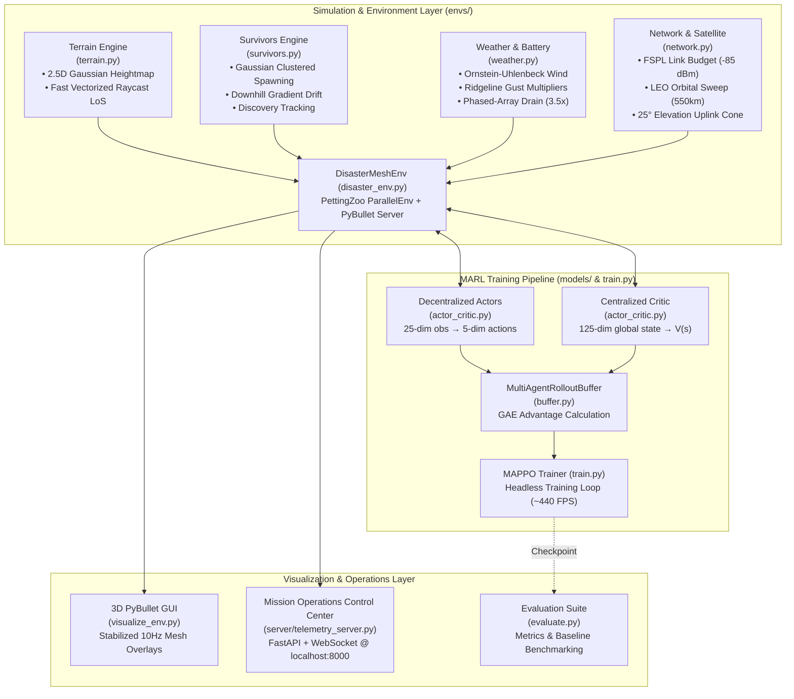
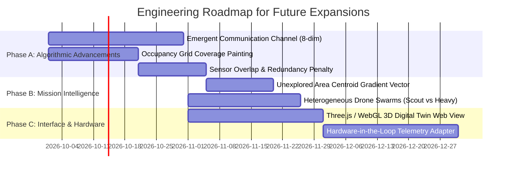

# 🛰️ Autonomous LEO-Integrated Drone Swarm Mesh Network
## Complete System Architecture, Mathematical Formulations, and Engineering Roadmap

---

## 1. Executive Summary & Problem Formulation

In humanitarian disaster operations (mountain landslides, forest floods, earthquakes), terrestrial communications towers and power infrastructure are frequently wiped out. Ground search-and-rescue (SAR) teams and isolated survivor clusters are trapped in rugged, non-line-of-sight terrain without cellular or satellite uplink capabilities.

This project designs, trains, and visualizes an **autonomous multi-agent drone swarm** that dynamically deploys over mountainous terrain to:
1. **Explore and locate moving ground survivor clusters** hidden in mountain basins and valleys.
2. **Establish a self-healing radio frequency (RF) mesh network** across the swarm using multi-hop relaying.
3. **Route critical ground telemetry to a passing Low Earth Orbit (LEO) satellite** via specialized Gateway drones.
4. **Manage severe energy constraints** (rapid battery depletion during Starlink phased-array uplinks and against high-altitude mountain wind gusts).

The swarm is trained entirely through **Multi-Agent Reinforcement Learning (MARL)** using **MAPPO (Multi-Agent Proximal Policy Optimization)** under the **Centralized Training with Decentralized Execution (CTDE)** paradigm.

---

## 2. Complete Technology Stack & Technical Rationale

| Layer | Technology | Version | Engineering Justification |
|---|---|---|---|
| **Multi-Agent Environment** | `PettingZoo` (`ParallelEnv`) | `v1.27.0` | Standardized Farama foundation for multi-agent RL; enables simultaneous synchronous stepping across all swarm drones. |
| **Physics & Kinematics** | `PyBullet` | `v3.2.7` | C++ physics engine with fast headless simulation for RL rollouts (~440+ FPS on CPU) and native OpenGL 3D visualization. |
| **Deep Learning Framework** | `PyTorch` | `v2.14.0` | Powers the MAPPO Actor-Critic neural networks, orthogonal layer initializations, and Generalized Advantage Estimation (GAE). |
| **Graph & Topology Routing** | `NetworkX` | `v3.6.1` | Efficient dynamic graph construction, edge weight path loss analysis, and shortest-path survivor-to-satellite data routing verification. |
| **Scientific Computing** | `NumPy` & `SciPy` | `v2.5.3` / `v1.18.1` | Vectorized heightmap generation, fast line-of-sight raycasting, and terrain gradient calculations. |
| **Web Telemetry Backend** | `FastAPI` & `Uvicorn` | `v0.141.1` / `v0.53.0` | Async Python web server providing high-frequency (20 Hz) WebSocket broadcasting of swarm states with minimal latency. |
| **Real-time Protocol** | `WebSockets` | `v14.2` | Bi-directional streaming between the running simulation loop and the browser frontend for live telemetry and remote commands. |
| **Mission Control Dashboard** | `HTML5 Canvas` / Vanilla CSS | Native ES6 | Zero-dependency, lightweight, high-performance tactical radar canvas and telemetry dashboard with zero buffer tearing. |

---

## 3. High-Level System Architecture



---

## 4. Detailed Component Mechanics & Mathematical Formulations

### 4.1. Topography & Fast Line-of-Sight (`envs/terrain.py`)
- **Continuous 2.5D Heightfield**: Generated as an overlapping superposition of $K=15$ two-dimensional bivariate Gaussian distributions:
  $$Z(x, y) = \sum_{k=1}^{K} A_k \exp\left( -\frac{(x - c_{x,k})^2 + (y - c_{y,k})^2}{2\sigma_k^2} \right)$$
  where amplitudes $A_k \in [2.0, 5.0]\text{ m}$ create realistic rolling mountainous peaks and passes across a $100\text{ m} \times 100\text{ m}$ domain.
- **Fast Vectorized Raycasting (`check_los`)**: Line-of-Sight (LoS) between 3D points $\mathbf{p}_A$ and $\mathbf{p}_B$ is evaluated in $O(N)$ vector operations:
  $$\mathbf{p}(t) = (1 - t)\mathbf{p}_A + t\mathbf{p}_B, \quad t \in [0, 1]$$
  If $Z(\mathbf{p}_x(t), \mathbf{p}_y(t)) > \mathbf{p}_z(t)$ at any sampled interpolation point along the ray, LoS is flagged as obstructed (`False`).

### 4.2. Ground Survivors & Downhill Drift (`envs/survivors.py`)
- **Gaussian Clustered Spawning**: Survivors spawn in $C=4$ realistic clusters with $2\text{ to }5$ individuals per cluster, confined within the safe inner $70\%$ terrain envelope ($[-35\text{ m}, +35\text{ m}]$) to ensure no entities spawn off map edges.
- **Downhill Gradient Drift**: Survivors move via biased Brownian motion pulled toward natural valleys and riverbeds along the negative terrain gradient:
  $$\mathbf{v}_{\text{drift}} = -\alpha \nabla Z(x, y) = -\alpha \left[ \frac{\partial Z}{\partial x}, \frac{\partial Z}{\partial y} \right]^T$$
  $$\mathbf{x}_{t+1} = \mathbf{x}_t + \mathbf{v}_{\text{drift}} \Delta t + \mathcal{N}(0, \sigma^2_{\text{noise}}) \Delta t$$
- **Discovery Mechanism**: A survivor is discovered if and only if:
  $$\|\mathbf{p}_{\text{drone}} - \mathbf{p}_{\text{surv}}\|_{xy} \le 15.0\text{ m} \quad \text{AND} \quad \text{check\_los}(\mathbf{p}_{\text{drone}}, \mathbf{p}_{\text{surv}}) = \text{True}$$

### 4.3. Dynamic Weather & Battery Consumption (`envs/weather.py`)
- **Ornstein-Uhlenbeck (OU) Wind Field**: Models continuous, stochastic, mean-reverting atmospheric turbulence:
  $$d\mathbf{w}_t = \theta (\boldsymbol{\mu}_w - \mathbf{w}_t) dt + \sigma_w d\mathbf{W}_t$$
- **Ridgeline Gust Amplification**: Wind forces intensify over steep ridges proportional to the local topography gradient:
  $$k_{\text{gust}}(x, y) = 1.0 + 2.0 \cdot \min\left( \frac{\|\nabla Z(x,y)\|}{0.5}, 1.0 \right)$$
- **Calibrated Battery Consumption Model**:
  $$\dot{B} = \left( \beta_{\text{base}} + \beta_{\text{wind}}\|\mathbf{w}\| + \beta_{\text{alt}}\max(z, 0) \right) \times M_{\text{role}}$$
  - **Relay Drones**: $\beta_{\text{base}} = 1.2\% / \text{sec}$ ($\approx 70\text{ s}$ operational endurance).
  - **Gateway Drones**: $M_{\text{role}} = 3.5\times$ power multiplier ($\approx 4.8\% / \text{sec}$, depletes in $\approx 20\text{ s}$ without role handoff).

### 4.4. RF Mesh Link Budget & LEO Satellite Sweeps (`envs/network.py`)
- **Free Space Path Loss (FSPL)**: Operates at $f = 2.4\text{ GHz}$:
  $$\text{FSPL}(\text{dB}) = 20\log_{10}(d_{\text{km}}) + 20\log_{10}(f_{\text{MHz}}) + 32.44$$
  $$P_{\text{rx}} = P_{\text{tx}} - \text{FSPL} - (30\text{ dBm if LoS is blocked})$$
  Link active if $P_{\text{rx}} \ge -85\text{ dBm}$. Decoupled design allows drop-in replacement with real hardware telemetry.
- **LEO Satellite Orbital Kinematics**:
  - Orbit Altitude: $550\text{ km}$ (Starlink constellation tier).
  - Sweeps west-to-east across the $100\text{ m}$ simulation boundary in $\approx 60\text{ s}$, followed by a $30\text{ s}$ orbital blackout.
  - Uplink Condition: Gateway role active, satellite in visible pass, and elevation angle:
    $$\theta_{\text{elev}} = \arctan\left( \frac{z_{\text{sat}} - z_{\text{drone}}}{\sqrt{(x_{\text{sat}} - x)^2 + (y_{\text{sat}} - y)^2}} \right) > 25.0^\circ$$

---

## 5. Multi-Agent Reinforcement Learning (MARL) Formulation

### 5.1. Observation Space (Decentralized, 25-dim per drone)
Each drone receives a normalized local observation vector:
- `obs[0:3]`: Drone normalized position $(x, y, z) / (L/2)$
- `obs[3:6]`: Drone velocity $(v_x, v_y, v_z) / v_{\max}$
- `obs[6:9]`: Orientation Euler angles (roll, pitch, yaw) $/ \pi$
- `obs[9:12]`: Instantaneous local wind vector $\mathbf{w} \times 10$
- `obs[12:15]`: Relative satellite vector $(\Delta x, \Delta y, \Delta z)$
- `obs[15]`: Satellite visibility flag ($1.0$ if in pass, $0.0$ if blackout)
- `obs[16]`: Normalized battery state $B_i / 100 \in [0, 1]$
- `obs[17]`: Active role indicator ($1.0$ for Gateway, $0.0$ for Relay)
- `obs[18:21]`: Relative vector to nearest undiscovered survivor cluster
- `obs[21]`: Swarm discovery rate ($\%$)
- `obs[22]`: Normalized distance to nearest neighbor drone
- `obs[23]`: Normalized nearest neighbor RSSI signal strength
- `obs[24]`: Terrain clearance / height directly below drone

### 5.2. Action Space (Continuous, 5-dim per drone)
- `act[0:3]`: 3D velocity setpoint $(v_x, v_y, v_z) \in [-1, 1] \implies [-2.0, 2.0]\text{ m/s}$
- `act[3]`: Gateway role selector ($> 0.0 \implies \text{Gateway}$, $\le 0.0 \implies \text{Relay}$)
- `act[4]`: RF transmission power level setpoint $[0.0, 1.0]$

### 5.3. 12-Signal Reward & Penalty Formulation
```
R_total = +20.0 * (new_clusters_discovered)
          + 5.0 * (survivors_connected_to_satellite)
          + 100.0 * (all_survivors_located_bonus)
          + 1.0 * (if battery > 50%)
          - 50.0 * (if terrain collision)
          - 30.0 * (if drone-to-drone collision)
          - 40.0 * (on battery exhaustion / crash)
          -  2.0 * (low battery warning when B < 20%)
          -  5.0 * (dropped survivor mesh link)
          -  3.0 * (if satellite is visible but no gateway uplinks)
          -  1.0 * (altitude penalty if AGL > 20m)
```

---

## 6. What Has Been Completed & Verified

1. **`envs/terrain.py`**: Complete 2.5D Gaussian topography generator with fast raycast line-of-sight obstruction detection.
2. **`envs/survivors.py`**: Bounded cluster spawning ($[-35, 35]\text{ m}$), downhill gradient drift, and LoS discovery logic.
3. **`envs/weather.py`**: Ornstein-Uhlenbeck wind field with ridgeline gusts, storm bursts, and dynamic battery drain.
4. **`envs/network.py`**: Decoupled FSPL RF link budget, NetworkX mesh topology routing, and LEO satellite orbital sweep model.
5. **`envs/disaster_env.py`**: Full PettingZoo `ParallelEnv` wrapper with PyBullet physics, Crazyflie bodies, and 12-signal reward engine.
6. **`models/actor_critic.py` & `models/buffer.py`**: MAPPO decentralized actor, centralized critic, and GAE rollout buffer.
7. **`train.py`**: Headless multi-agent PPO trainer achieving **~440+ FPS on CPU** with checkpointing to `models/`.
8. **`evaluate.py`**: Benchmark suite evaluating discovery percentage, connected survivors, and battery retention against baselines.
9. **`visualize_env.py`**: Stabilized 3D PyBullet GUI (strobe flickering eliminated, wide-angle $85\text{ m}$ camera framing the entire mountain basin).
10. **`server/telemetry_server.py`**: High-performance FastAPI + WebSocket Mission Control Center featuring an interactive HTML5 tactical radar map, live satellite pass tracker, swarm health diagnostics, and remote command deck.

---

## 7. Prioritized Future Additions Roadmap



### 7.1. Emergent Communication Channel (Highest Priority)
- **Concept**: Add an $M=8$ continuous action channel to each drone. When Drone $i$ acts, it emits latent vector $\mathbf{m}_i \in \mathbb{R}^8$. Neighbors within RF range receive $\mathbf{m}_i$ in their observation space.
- **Impact**: Removes human bias in coordination rules. Drones autonomously invent an emergent communication protocol to negotiate search sectors (e.g. *"I am clearing North, you sweep South"*) and coordinate battery-saving Gateway handoffs.

### 7.2. Occupancy Grid "Coverage Painting" & Overlap Penalty
- **Concept**: Discretize the mountain basin into a $50 \times 50$ occupancy grid. As drones fly overhead, their downward sensor cone marks unvisited cells as "scanned" (rendered as a glowing sweep trail on the radar).
- **Overlap Penalty**: Penalize multiple drones if their scanning cones overlap on the same timestep:
  $$R_{\text{overlap}} = -\gamma \cdot \text{Area}(\text{Footprint}_A \cap \text{Footprint}_B)$$
  Forces the swarm to diverge and sweep the disaster zone with maximal efficiency.

### 7.3. Unexplored Centroid Vector (Observation Gradient)
- **Concept**: Compute the 2D center-of-mass of all remaining unvisited grid cells:
  $$\mathbf{c}_{\text{unexplored}} = \frac{1}{|U|} \sum_{\mathbf{u} \in U} \mathbf{u}$$
  Feed the unit vector $(\mathbf{c}_{\text{unexplored}} - \mathbf{p}_i) / \|\dots\|$ into the drone's observation vector so the policy has an explicit directional gradient to follow when searching unexplored sectors.

### 7.4. Heterogeneous Drone Swarm Roles
- Differentiate the swarm into:
  - **Scout Crazyflies**: Small, lightweight, high speed ($3.5\text{ m/s}$), small battery, dedicated to valley exploration.
  - **Gateway Heavy-Lifters**: Larger quadcopters carrying high-gain directional antennas, high battery capacity, dedicated to high-altitude ridge hovering.

### 7.5. Three.js / WebGL 3D Browser Digital Twin
- Expand the web-based Mission Control Center with a full 3D interactive terrain twin using **Three.js** or **Babylon.js**, allowing users to fly through the mountain terrain directly in their browser without requiring local PyBullet GUI dependencies.

### 7.6. Hardware-in-the-Loop (HIL) Satellite Testbed
- Replace the synthetic FSPL link budget in `envs/network.py` with physical Software Defined Radio (SDR) or hardware serial telemetry from an actual benchtop CubeSat / Starlink receiver module.

---

## 8. Verification & Quick-Start Execution Guide

### Start the Mission Operations Control Center (Web UI):
```bash
python drone_mesh_rl/server/telemetry_server.py
```
Open **`http://localhost:8000`** in any web browser to view the interactive tactical radar, live satellite orbit passes, and drone battery telemetry.

### Launch Headless MAPPO Swarm Training:
```bash
python drone_mesh_rl/train.py --num_drones 5 --num_clusters 4 --total_timesteps 50000 --save_path drone_mesh_rl/models/mappo_drone_mesh.pt
```

### Benchmark Policy vs. Baseline:
```bash
python drone_mesh_rl/evaluate.py --model_path drone_mesh_rl/models/mappo_drone_mesh.pt --episodes 10
```

### Launch Stabilized 3D PyBullet Visualizer:
```bash
python drone_mesh_rl/visualize_env.py --model_path drone_mesh_rl/models/mappo_drone_mesh.pt
```
*(Key controls: `Space` = Pause/Resume, `R` = Reset Episode, `Q` or `ESC` = Exit)*
